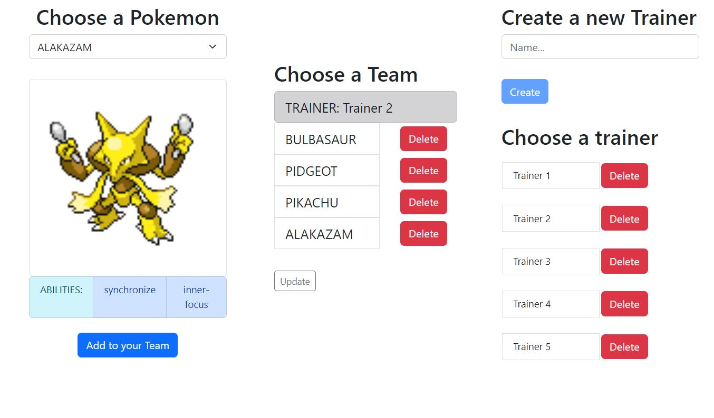

# Angular-Wrap-Up-Pokemon

### Introduction

 

For this project, we will make a Pokemon app! in this app, we will have 3 sections, Pokedex and Trainers and Teams. In Pokedex, we will be presented with a paginated list of all pokemon names, and when clicking a name a detailed view will be shown with an image, stats, and a Pokedex entry from the selected pokemon, it will be a good source of knowledge if you aren't familiar with the pokemon names. In Trainers, we will be able to create and delete pokemon trainers with name, age and hobby. In Teams, we will be able to select a trainer and see their pokemon team and add/remove pokemon to that team.

  

### Requirements

 

Your project must meet all of the requirements below:

**Core Functionality**

 

1. Include a Java/Spring Boot backend and an Angular frontend.
2. We will use [this API](https://pokeapi.co) to retrieve the info of every pokemon.
3. Trainer and team info must be stored in your backend DB. 
4. In the Teams section, when typing a pokemon name to add it to a team you must make the field case **insensitive** and make it submit the pokemon name when pressing enter as an alternative to pressing the add button.
5. A pokemon Team can only hold up to 7 pokemon, if trying to add more you must display a warning message and refuse the operation.
6. If you type a name that doesn't belong to a pokemon you must display an error message.
7. Hovering the pokemon cards (in Teams and Pokedex) and trainer cards (in trainers) must make them change color, use event binding for this implementation.
8. In Teams, the pokemon card must contain the image, name, and types of the pokemon and have a button to toggle between displaying its stats (attack, defense, speed, etc) or not.
9. In Pokedex, you must display a simple list with buttons to cycle between pages from up to 20 pokemon and when clicking a name you must display a detailed view with any English Pokedex entry (everything is provided in the Pokemon API).

